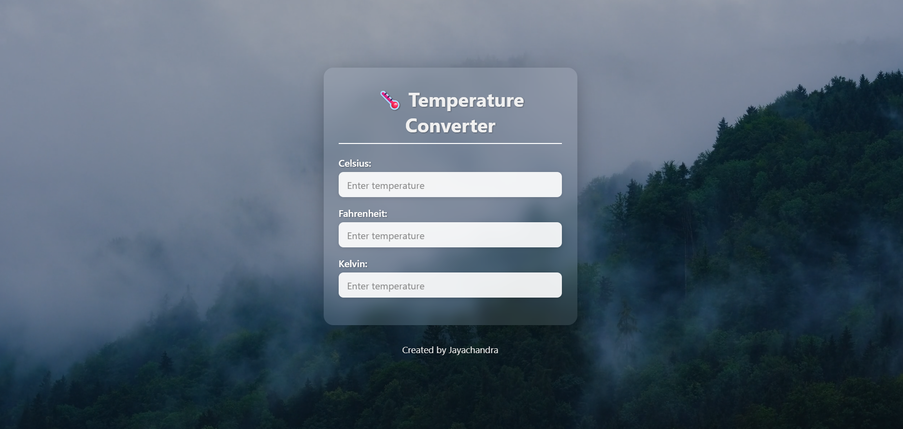

# 🌡️ Temperature Converter

A beautiful, responsive **Temperature Converter** web application that allows users to convert temperature values between **Celsius**, **Fahrenheit**, and **Kelvin** in real-time.

## 📌 Features

- ✅ Real-time temperature conversion
- ✅ Supports Celsius, Fahrenheit, and Kelvin
- ✅ Glassmorphism design with video background
- ✅ Clean and responsive layout
- ✅ Smooth UX with input validation

---

## 🛠️ Tech Stack

| Frontend | Language   | Tools        |
|----------|------------|--------------|
| HTML5    | JavaScript | VS Code      |
| CSS3     |            | Git & GitHub |
